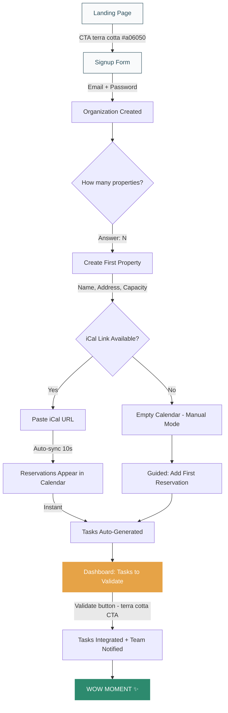
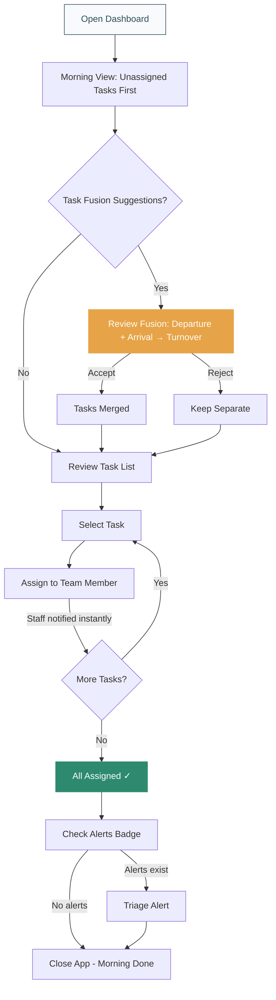
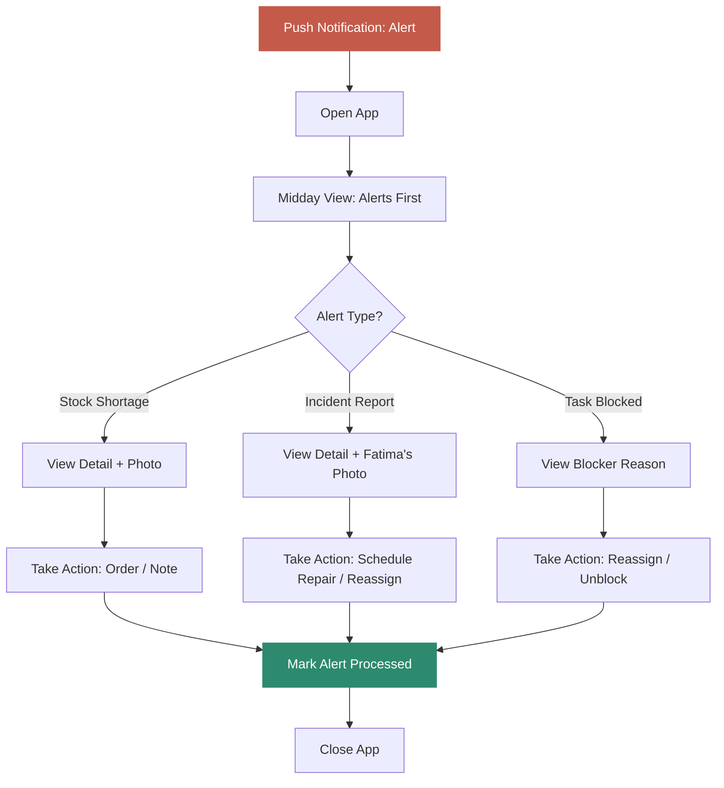
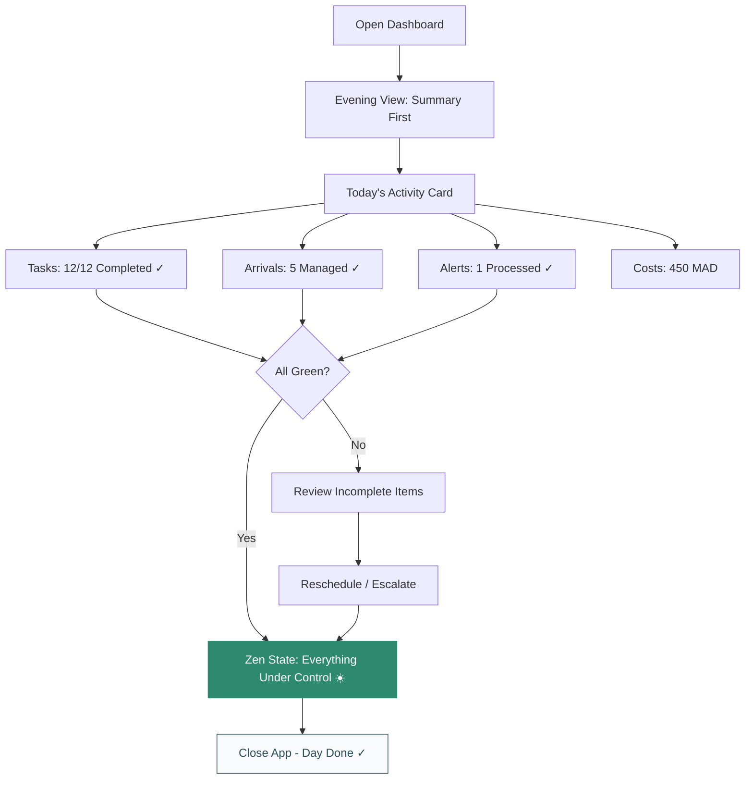
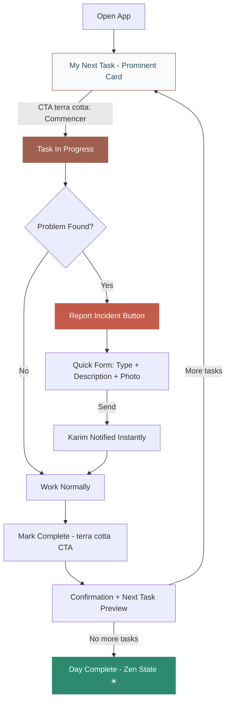
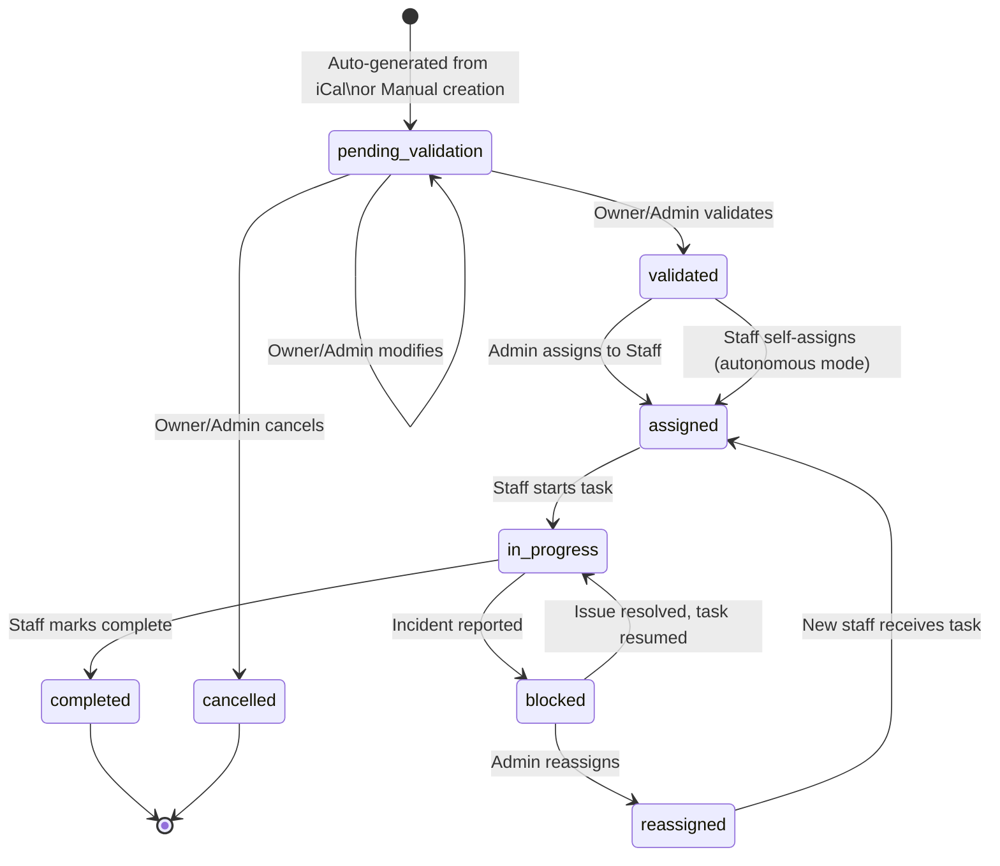
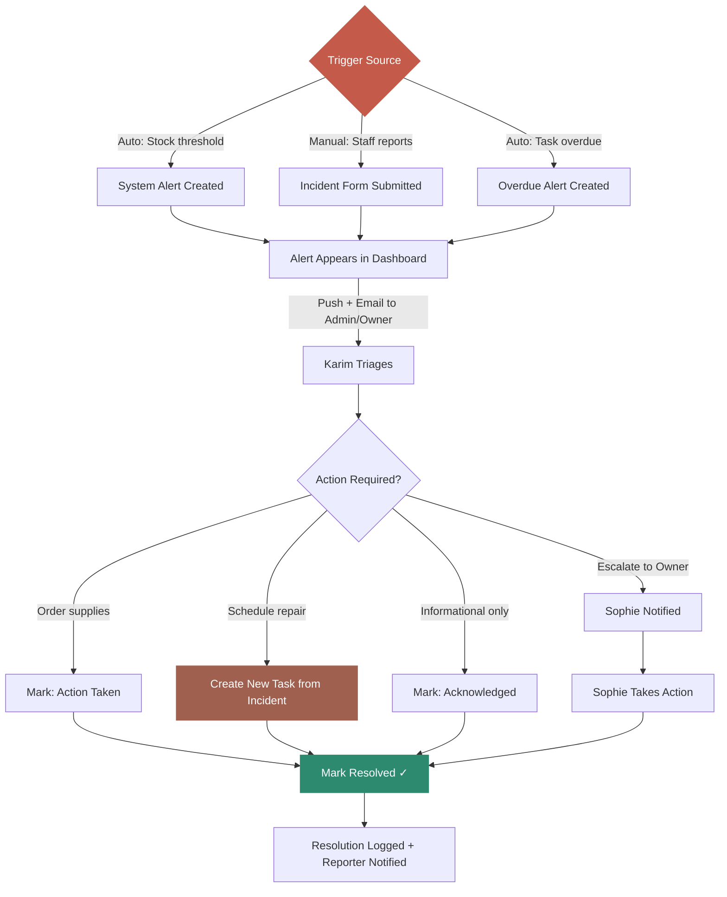

---
stepsCompleted:
  - 1
  - 2
  - 3
  - 4
  - 5
  - 6
  - 7
  - 8
  - 9
  - 10
  - 11
  - 12
  - 13
  - 14
inputDocuments:
  - _bmad-output/planning-artifacts/prd.md
  - _bmad-output/planning-artifacts/prd-validation-report.md
  - docs/prd.md
  - docs/brainstorm/Design_Produit_Vision_UI_UX.md
  - docs/brainstorm/Hoxtup_Kit.md
  - docs/brainstorm/Landing_page_marketing_conversion.md
  - docs/brainstorm/PRD_MVP.md
  - docs/brainstorm/PRD_complet_Design_Pricing.md
---

# UX Design Specification Hoxtup

**Author:** Barry
**Date:** 2026-02-07

---

## Executive Summary

### Project Vision

Hoxtup is an all-in-one operational cockpit for short-term rental managers — replacing Excel, WhatsApp, and paper notes with a single responsive web platform. It handles reservations (manual + iCal sync), team coordination, task management with intelligent fusion, stock tracking, permanent asset logging, and cost visibility.

**Market:** SaaS B2B targeting property owners (1-30+ rentals), agencies, and professional hosts. Initial launch: Morocco (Marrakech), then France and Canada. Aggressive pricing at 50%+ below competitors (Properly, Turno, Breezeway).

**Core UX Promise:** "Here, everything is under control." — The product must reduce stress, not add it. Every screen answers two questions: *What's happening?* and *What do I need to do?*

### Target Users

**Critical constraint: ALL user profiles must have a fully functional and comfortable mobile experience.** The app is responsive-first — desktop enriches the experience, but mobile must never feel like a degraded version.

| Persona | Role | Primary Device | UX Need | Tech Level |
|:---|:---|:---|:---|:---|
| **Sophie** (Owner, 5 properties) | Owner | Mobile + Desktop | Overview, stock alerts, peace of mind | Medium |
| **Karim** (Agency, 20 properties) | Admin/Manager | Desktop + Mobile | Team coordination, fast assignment, reporting | Good |
| **Fatima** (Field cleaning) | Staff (Autonomous) | Smartphone only | Simple task list, quick actions, incident reporting | Basic |
| **Fatima-B** (Field cleaning, no phone) | Staff (Managed) | No app access | Informed externally, Manager handles all task updates | N/A |
| **Ahmed** (Property owner client) | Client (post-MVP) | Desktop + Mobile | Read-only visibility, PDF exports | Medium |

**Dual Staff Model:**
- **Autonomous Staff** — Has an account, uses the app, manages own task statuses
- **Managed Staff** — No account required. Represented as a staff profile. Manager/Admin handles all task status updates (past, current, future) on their behalf via proxy management. Staff is informed through external channels (phone, in-person)

**Desired user sentiment:** "I feel at ease" / "I don't forget anything" / "I see everything" / "I control my costs"

### Key Design Challenges

1. **Dual-persona in a single app** — The interface must serve a manager coordinating 20 properties AND a cleaner who just needs her next task. Both modes must work flawlessly on mobile. The navigation adapts contextually per mode.

2. **Adaptive Focus Mode (not a binary toggle)** — Context drives the experience, not a switch. When navigating the calendar, the user is in manager context. When viewing an assigned task, they're in field context. An explicit mode toggle is only visible for users with dual-role access, and even then it's a "focus shift", not a universe change.

3. **Information density vs cognitive calm** — The executive dashboard aggregates tasks, arrivals, departures, alerts, costs, and pending validations. Risk of cognitive overload — directly contradicting the "calm operations" promise. Progressive disclosure is essential.

4. **Progressive onboarding** — Sophie must understand the app in < 30 minutes. First contact: 1 free property + iCal paste → calendar fills in 10 seconds. Feature discovery is phased: Day 1 = properties + iCal. Day 3 = tasks. Week 2 = stock. Never show everything at once.

5. **Proxy task management UX** — Managers must rapidly update task statuses on behalf of staff (batch updates, retroactive completions on past tasks, current updates, future pre-validations). This is a high-frequency workflow — swipe/tap for speed, not click-open-edit-save.

6. **Real-world mobile conditions** — Field staff use phones in bright sunlight, potentially with wet or busy hands. Large touch targets (48px min), high contrast, actions in 1-2 taps maximum. Managers also use mobile on-the-go — their mobile experience must not be an afterthought.

7. **Conversion UX by pricing tier** — Free/Starter users should see subtle previews of premium features (e.g., a grayed-out cost chart with "Available in Pro") to drive natural upgrade desire. Pro/Scale users should feel the full value of their investment through richer experiences.

8. **Educative empty states** — Every empty screen is an opportunity for guided discovery, not confusion. Empty states must be educational and encouraging, leading users to their next meaningful action.

### Design Opportunities

1. **Task Fusion Engine as a UX differentiator** — The Turnover fusion suggestion can be an elegant, satisfying interaction if well-designed. No competitor offers this.

2. **"Tasks first" mobile landing with integrated mini-dashboard** — Opening the app shows a single unified screen: a compact summary header (3 KPIs max — today's tasks, alerts, arrivals) followed immediately by the task list. One screen, two levels of reading. Satisfies both "instant overview" and "actionable first" needs.

3. **Radically simple Field Mode** — A glorified todo list for autonomous staff. Competitive advantage vs tools that force complex interfaces on field workers.

4. **Batch proxy management** — The "Team Tasks" view enables managers to update multiple task statuses in rapid succession (swipe to complete, tap to flag) — covering past, current, and future tasks. A workflow no competitor optimizes for.

5. **Warm premium palette** — Color inspiration from stakeholder creates "premium but approachable" — confidence (teals/blues), warmth (terra cotta for brand accents, NOT alerts), breathing space (whites/grays). An app you open every day without visual fatigue.

### Design Constraints & Decisions

| Decision | Choice | Rationale |
|:---|:---|:---|
| **Mobile navigation** | Bottom nav, 3-4 items, contextual per mode | Thumb-friendly, reduced cognitive load, relevant items per context |
| **Manager Mode bottom nav** | Dashboard / Calendar / Tasks / More(...) | Core manager workflows accessible in one tap |
| **Field Mode bottom nav** | My Tasks / Alerts / Profile | Minimal, action-oriented |
| **Theme** | Light mode only | Simplicity, consistent brand feel, MVP focus. CSS tokens structured for future dark mode. |
| **Icon style** | Duotone (primary), outlined/filled when relevant | Visual richness without heaviness, flexible per context |
| **Mode switching** | Adaptive Focus Mode (context-driven, not binary toggle) | Navigation drives context; explicit toggle only for dual-role users |
| **Default mobile view** | Today's tasks + upcoming + mini-dashboard header | Actionable-first philosophy with instant overview |
| **Staff model** | Autonomous (with account) + Managed (proxy, no account) | Real-world flexibility for teams where not all staff have phones |
| **Logo** | Not yet designed (see `logo-brief.md`) | Separate logo brief provided for LLM-assisted creation |
| **All-mobile mandate** | Every profile must work comfortably on mobile | Not just Staff — Owners and Managers use mobile regularly |
| **Empty states** | Educational and action-oriented | Every empty screen guides toward next meaningful action |
| **Tier-aware UX** | Subtle premium feature previews for lower tiers | Drive natural upgrade conversion without hard paywalls |

### Color System

**Brand Palette (inspiration-derived):**

| Token | Hex | Usage |
|:---|:---|:---|
| `--color-brand-primary` | `#264653` | Navigation, headers, primary actions, text |
| `--color-brand-accent` | `#d28370` | Brand accents, CTA secondaries, warm highlights |
| `--color-surface-light` | `#83c6e1` | Informational elements, badges, active states |
| `--color-bg-primary` | `#f8fafc` | Page backgrounds, cards |
| `--color-bg-secondary` | `#E5E7EB` | Dividers, subtle backgrounds, disabled states |

**Functional Colors (derived from brand palette):**

| Token | Hex | Usage |
|:---|:---|:---|
| `--color-status-success` | `#2D8A6E` | Task completed, positive confirmations |
| `--color-status-warning` | `#E6A347` | Attention needed, stock alerts, pending validations |
| `--color-status-error` | `#C45B4A` | Urgent issues, incidents, errors |
| `--color-status-info` | `#83c6e1` | Informational badges, tips, neutral states |

**Design principle:** Even alert colors remain premium and restrained — no aggressive reds or neon highlights. The visual tone stays calm at all times.

## Core User Experience

### Defining Experience

**Dual Core Action Model:**

Hoxtup serves two fundamentally different core actions that coexist on the same screen:

1. **Operational Action** (Fatima, Karim proxy) — "See my tasks → Act on them." The primary loop is: view task → execute (start/complete/flag) → move to next. Speed and simplicity define this action.

2. **Decisional Action** (Sophie, Karim manager) — "See the state → Feel reassured." The primary loop is: open app → scan KPIs → confirm everything is on track → close app. Calm and clarity define this action.

Both actions are served by the unified "Tasks First + Mini-Dashboard" home screen:
- **Top section (decisional):** 3 KPIs max — today's tasks status, active alerts, upcoming arrivals. Sophie scans this and knows if she needs to act.
- **Bottom section (operational):** Task list — today's, upcoming, and overdue. Fatima/Karim scroll here to act.

**The "Zen State" — Designing for "Nothing to Do":**

When all tasks are completed and no alerts are active, the home screen enters a positive "Zen State":
- Mini-dashboard shows "0 pending · 0 alerts" with a subtle success tint
- Task list shows today's completed tasks with satisfying checkmarks
- A discreet message: "Everything is under control today"
- This is an intentional design moment — the absence of work should feel rewarding, not empty

### Platform Strategy

| Dimension | Decision | Rationale |
|:---|:---|:---|
| **Platform** | Responsive web app (single codebase) | Maximum reach, no app store dependency, faster MVP |
| **Primary input** | Touch (mobile priority), mouse/keyboard (desktop) | All profiles use mobile regularly |
| **Offline strategy** | Optimistic UI with retry queue | Not offline-first, but actions (complete task, report incident) are queued locally and synced on reconnect. Critical for field staff in areas with intermittent 4G (Morocco). Cached data remains visible with a "Connection lost" banner. |
| **Device capabilities** | Camera (incident photos), browser notifications | Minimal native API usage for MVP |
| **Breakpoints** | Mobile (< 640px), Tablet (640-1024px), Desktop (> 1024px) | Standard responsive tiers |
| **API strategy** | Single "home feed" endpoint | KPIs + first N tasks in one request. Server-side aggregation for < 3 second load. |

### Effortless Interactions

The following interactions must feel completely natural and require minimal cognitive effort:

| Interaction | Target | Gesture | Max Steps |
|:---|:---|:---|:---|
| **See today's state** | All profiles | Open app | 0 (instant) |
| **Complete a task** | Staff, Proxy | Swipe right or tap checkmark | 1 |
| **Assign a task** | Manager | Tap task → tap staff name | 2 |
| **Batch proxy update** | Manager | Consecutive swipes on team task list | 1 per task |
| **Report an incident** | Staff, Manager | Tap "Problem" → select type → optional photo → send | 3-4 |
| **Accept task fusion** | Manager | Tap "Merge into Turnover?" → Accept | 1 |
| **iCal initial import** | Owner | Paste URL → reservations appear | 1 |
| **Undo an action** | All profiles | Tap "Undo" on toast notification | 1 |

**Error protection pattern:** For destructive or retroactive actions (e.g., completing a past task via proxy, deleting a reservation), use an **undo toast** (Gmail-style "Action done — Undo") rather than a confirmation dialog. This preserves speed while protecting against mistakes.

### Critical Success Moments

**Onboarding & First Value:**

| Moment | Success State | Failure State |
|:---|:---|:---|
| **First launch** | Calendar fills with reservations in < 10 sec after iCal paste | Empty page, confusion about next step |
| **First auto-task** | Clear notification, validated in 1 tap, user understands the system | Tasks appear without explanation → distrust |
| **First Task Fusion** | Elegant suggestion, accepted in 1 tap → immediate time saving | Confusing suggestion → user ignores all future fusions |

**Retention & Habit Formation:**

| Moment | Success State | Failure State |
|:---|:---|:---|
| **J+7 "Habit moment"** | User has opened the app 3+ consecutive days and completed a useful action → Hoxtup is part of the routine | App opened once, not returned to → churn |
| **First "Save" moment** | A stock alert or auto-task prevented a real problem → "Hoxtup saved me" | No tangible value experienced in first 2 weeks → abandonment |
| **Proxy management** | Manager updates 10 tasks in < 2 minutes for the team | Manager must open each task individually → gives up, uses WhatsApp |

**Conversion:**

| Moment | Success State | Failure State |
|:---|:---|:---|
| **Free → Starter** | Subtle premium preview → "I need this" → natural upgrade | Hard paywall → frustration → unsubscribe |
| **Stock alert value** | Alert arrives before stockout → order placed in time | Alert too late or drowned in noise → lost trust |

### Experience Principles

These six principles guide every UX decision in Hoxtup:

1. **"Actionable in 3 seconds"** — Every screen must allow the user to understand the state AND act in under 3 seconds. No scrolling to find the button. No reading paragraphs to understand context.

2. **"One gesture, one outcome"** — The most frequent actions (complete, assign, flag) require a single gesture. Swipe, tap, done. No multi-step forms for routine operations.

3. **"Calm by default, alert by exception"** — The app's normal state is calm (soft colors, airy layout). Alerts are rare and targeted — when they appear, they deserve attention. The Zen State (nothing to do) is a designed positive moment.

4. **"Context is the mode"** — The interface adapts to what the user is doing, not to an explicit switch. Navigating to the calendar = planning context. Opening assigned tasks = field context. The mode follows the user's intent.

5. **"Everyone's mobile is first-class"** — No profile gets a degraded mobile version. Mobile is designed natively for the thumb, not shrunk from desktop. Touch targets ≥ 48px, high contrast, one-hand operation.

6. **"Proxy is a first-class workflow"** — Managing tasks on behalf of the team is not a secondary feature. It's a central, speed-optimized flow with batch operations, undo protection, and retroactive updates across past, present, and future tasks.

## Desired Emotional Response

### Primary Emotional Goals

| Emotion | UX Translation | Target Persona |
|:---|:---|:---|
| **Serenity / Control** | "Everything is under control, even when I'm not looking" | Sophie (Owner) |
| **Efficiency / Flow** | "I do in 2 min what used to take me 15 min" | Karim (Manager) |
| **Simplicity / Clarity** | "I know exactly what to do, no confusion" | Fatima (Staff) |
| **Trust / Reliability** | "The app never lets me forget anything" | All profiles |

### Emotional Journey Mapping

| Stage | Desired Emotion | Anti-Emotion to Avoid |
|:---|:---|:---|
| **Discovery (landing page)** | Curiosity + Recognition ("this is exactly my problem") | Skepticism ("yet another generic tool") |
| **Signup / Onboarding** | Ease + Positive surprise ("that's already done?!") | Fatigue ("10 more fields to fill") |
| **First iCal import** | Wonder ("wow, my calendar is already here!") | Disappointment ("it doesn't work / it's empty") |
| **Daily usage** | Calm + Mastery ("everything is running smoothly") | Stress ("too many notifications, too much info") |
| **Zen State (nothing to do)** | Satisfaction + Pride ("my team is handling it well") | Emptiness ("the app is useless today") |
| **Alert / Incident** | Confidence + Controlled urgency ("I was warned in time") | Panic ("it's too late") |
| **Error / Mistake** | Reassurance ("I can easily fix this — undo") | Frustration ("I lost my data") |
| **Task Fusion suggestion** | Intelligent satisfaction ("the app thinks for me") | Confusion ("what is this?") |
| **Return after absence** | Easy re-entry ("I can see what I missed") | Overwhelm ("too much backlog, I give up") |

### Micro-Emotions

The most critical emotional pairs for Hoxtup's success:

1. **Confidence vs Skepticism** — Critical from first contact. The app must inspire trust immediately (polished design, data visible quickly, no vague promises). A first-try iCal import that works = trust installed.

2. **Accomplishment vs Frustration** — Every completed task must give a micro-feedback reward (subtle animation, satisfying checkmark). Frustration comes from actions requiring too many steps or unrecoverable errors.

3. **Calm vs Overload** — The central tension of Hoxtup. A dashboard with 13 modules could easily overwhelm. Calm comes from the "calm by default" design: soft colors, progressive disclosure, rare and targeted notifications.

4. **Pride vs Invisibility** — Sophie must feel that Hoxtup SHOWS her its value ("3 incidents prevented this month", "12h saved"). Without this, the tool becomes invisible and replaceable.

### Design Implications

| Target Emotion | Concrete UX Decision |
|:---|:---|
| **Serenity** | Calm palette (teal/white), soft animations, no aggressive red, positive Zen State |
| **Efficiency** | One-gesture actions, batch proxy, swipe-to-complete, no confirmation dialogs |
| **Simplicity** | Ultra-minimalist Field Mode, 3-4 bottom nav items, progressive feature discovery |
| **Trust** | Undo toast (never irreversible loss), data visible immediately, sync status indicator |
| **Accomplishment** | Completion micro-animations, Zen State message, visible completed task count |
| **Pride** | Discreet insights ("You managed X tasks this week"), soft conversion via demonstrated value |
| **Positive surprise** | Instant iCal import, Task Fusion suggestion, onboarding < 2 min |

### Emotional Design Principles

1. **"Reward the routine"** — Repetitive actions (completing a task, checking the dashboard) must give positive micro-feedback. Not confetti, but a satisfying checkmark and a counter that advances.

2. **"Silence is golden"** — The absence of notification IS the signal that everything is fine. Notifications are only sent when action is required. Silence = serenity.

3. **"Show the value, don't claim it"** — Never say "Hoxtup saves you time." SHOW "12 auto-generated tasks this month" and let the user draw the conclusion.

4. **"Errors are recoverable, always"** — No action is irreversible without undo. Fear of mistakes kills efficiency. The undo toast transforms anxiety into confidence.

5. **"Progressive trust"** — Onboarding doesn't ask for everything at once. Day 1: trust us with 1 property. Week 2: now try tasks. Month 1: see your costs. Trust is built, not forced.

## UX Pattern Analysis & Inspiration

### Inspiring Products Analysis

#### Direct Competitors / Rental Domain

**Millenium Connect** (direct competitor, Morocco)
- Unified dashboard, omnichannel messaging (WhatsApp/Messenger/Instagram/email), auto task assignment after departures, instant progress tracking
- Same functional scope as Hoxtup (Calendar → Messaging → Housekeeping → Booking → Reports)
- **Weakness:** Hotel/riad-oriented UX, not designed for small owners like Sophie. No simplified field mode. No stock/asset management. Requires a demo to get started
- **Lesson:** Validates the Morocco market. Opportunity for Hoxtup = same scope, 10x simpler and warmer UX. Anti-pattern: "Book a demo" model — Hoxtup must be self-service and self-explanatory

**Lodgify** (#1 global vacation rental software)
- Guided onboarding (academy, consultations, integration calls), solid channel manager, integrated website builder, AI automation, guest registration
- Module progression: Channel Manager → PMS → Automation → Analytics → Guest Registration
- **Weakness:** Dense interface, experienced-manager oriented. No field mode. Mobile app exists but isn't the core experience. Complex pricing (per property + booking percentage)
- **Lesson:** Functional completeness is a benchmark. But their desktop-first pro UX leaves massive room for a mobile-first, field-ready, visually calm Hoxtup

**Airbnb Host Dashboard**
- Polished UX familiar to hosts, clear per-booking notifications, integrated messaging, performance stats, visual calendar
- **Key pattern: "Today" view** — daily summary of what's happening (arrivals, departures, messages). Exactly our "Tasks First + Mini-Dashboard" concept
- **Weakness:** Airbnb-only. No team coordination. No stock. Limited multi-property. No tasks
- **Lesson:** The "Today" pattern is validated and loved by hosts. Adopt this mental model but enrich it with tasks, team, and stock. This is **UX judo** — leveraging existing host habits for instant cognitive transfer. Copy the mental model, not the UI

#### Productivity Apps

**Todoist**
- Ultra-fast task adding (quick add), organization by project/label/filter, natural date parsing ("tomorrow 2pm"), satisfying completion micro-animation, karma/streak motivation
- **Key patterns:** "Today / Upcoming" view structure. Quick Add from any screen. Tap checkmark to complete
- **Lesson:** The "Today / Upcoming" pattern maps directly to our task view. Quick-add for manual tasks. Completion animation for "Reward the routine"

**Things 3**
- Premium minimalist design, impeccable visual hierarchy (titles, subtasks, notes), fluid gesture interactions, "This Evening" as temporal concept, no gamification — just clarity
- **Key patterns:** Inbox / Today / Upcoming / Anytime / Someday as mental model. Subtasks visible but non-invasive. Natural drag-to-reorder
- **Lesson:** The **premium minimalist** tone of Things is exactly the visual direction Hoxtup needs. Proof that a B2B tool doesn't have to look like an ERP. Reference for task list hierarchy

**Google Calendar**
- Multi-view (day/week/month), color-coding by category, fast event creation (tap on slot), "Schedule" view (chronological list), reliable sync
- **Key patterns:** Color-coding by category = our color-coding by property. "Schedule" view (list) vs "Calendar" view (grid) as two reading modes
- **Lesson:** Dual calendar view — grid for planning (Karim), chronological list for operational (Sophie mobile). Color-coding per property is a must. **Calendar view switcher** as a pill toggle at the top with 4 views (Global, By Property, By Employee, By Task Type) with intelligent defaults per profile

#### Daily-Use Apps

**WhatsApp**
- Zero onboarding (number → ready), universally understood UX even by non-tech profiles, instant photo sending, read status, identical interface everywhere
- **Key pattern:** Radical simplicity. List → Detail → Action is universal
- **Lesson:** The **simplicity benchmark for Fatima**. Incident reporting (photo + text) must be as easy as sending a WhatsApp message. If Fatima can use it without training, we've won

**Airtable**
- View flexibility (table, kanban, calendar, gallery, form), powerful filters, table relations, real-time collaboration, customizable fields
- **Key pattern:** Multiple views of the same data — a task seen as list, kanban by status, calendar by date, gallery by property. View Switcher concept
- **Lesson:** The "same data, multiple views" pattern is powerful for calendar/tasks. Kanban by status (Pending → Todo → In Progress → Done) for Manager Mode. **Simplify to 2-3 default views** with smart defaults rather than Airtable's full configuration spectrum

**Voicenotes**
- Instant capture (one tap → record), automatic transcription, tag organization, ultra-minimalist interface, zero friction between idea and capture
- **Key pattern:** "Zero-friction capture" — the most frequent action accessible in a single gesture from the home screen
- **Lesson:** Incident reporting could adopt this pattern — a persistent "Problem" button in Field Mode opening directly to capture (photo + description). Zero friction between "I see a problem" and "it's reported". Voice-to-text for incident description planned for v1.1

### Transferable UX Patterns

**Navigation Patterns:**
- **"Today" home screen** (Airbnb Host + Todoist) → Tasks First + Mini-Dashboard unified view
- **Dual calendar view** (Google Calendar) → Grid for planning + Chronological list for operational
- **View Switcher with pill toggle** (Airtable + Google Calendar) → 4 calendar views with intelligent default per profile (Sophie → By Property, Karim → Global)
- **Contextual bottom nav** (Things 3) → 3-4 items max adapted to active mode

**Interaction Patterns:**
- **Tap checkmark to complete** (Todoist) → Task completion in one gesture. Preferred over swipe for MVP web reliability (swipe conflicts with browser navigation). Swipe-to-complete considered for v1.1
- **Quick Add** (Todoist) → Fast manual task creation with pre-filled context (property, type, assignee)
- **Zero-friction capture** (Voicenotes) → Persistent "Problem" button for instant incident reporting
- **Color-coding by property** (Google Calendar) → Instant visual identification across calendar and task views

**Visual Patterns:**
- **Premium minimalist** (Things 3) → Clear typography, white space, visual hierarchy. The visual tone reference
- **Completion micro-animations** (Todoist) → Satisfying feedback for "Reward the routine"
- **Radical simplicity** (WhatsApp) → Field Mode must be as simple as a chat: list → detail → action

**Data Patterns:**
- **Client-side normalized data** for instant view switching (no re-fetch when toggling calendar views)
- **"Today" endpoint** combining KPIs + first N tasks in a single API call

### Anti-Patterns to Avoid

| Anti-Pattern | Source | Why Avoid |
|:---|:---|:---|
| **Dense ERP-style dashboard** | Lodgify, Millenium Connect | Cognitive overload, contradicts "calm operations" |
| **Desktop-first with mobile afterthought** | Lodgify | All profiles use mobile |
| **"Book a demo" onboarding** | Millenium Connect | If the app needs a demo, the UX has failed. Empty states ARE the demo |
| **Aggressive push notifications** | General rental apps | Contradicts "Silence is golden" |
| **Swipe gestures on mobile web** | General web apps | Unreliable on MVP web (browser conflicts). Use tap checkmark instead. Revisit in v1.1 |
| **Excessive gamification** | Some productivity apps | Doesn't match "premium discret" tone |
| **Unconstrained view configuration** | Airtable | Users need smart defaults, not a configuration screen. Views should just work |
| **Pricing anxiety in-app** | Lodgify (% per booking visible) | Creates anxiety, not serenity |

### Design Inspiration Strategy

**Adopt directly:**
- **"Today" home screen** (Airbnb) — mini-summary + today's tasks
- **Tap checkmark to complete** (Todoist) — universal gesture for completion
- **Color-coding by property** (Google Calendar) — instant visual identification
- **Premium minimalist tone** (Things 3) — the visual reference
- **Zero-friction incident capture** (Voicenotes) — tap → photo → send
- **"Today" as UX judo** (Airbnb) — leverage host habits for instant recognition, Hoxtup look

**Adapt for Hoxtup:**
- **View Switcher** (Airtable) → Simplify to 4 pre-built views with pill toggle and intelligent default per profile
- **Quick Add** (Todoist) → Context-aware for rental tasks (property, type, assignee pre-filled)
- **Dual calendar** (Google Calendar) → By-property as default view, not by-day
- **Kanban** (Airtable) → Task status board for Manager Mode only, not exposed to Field Mode

**Avoid:**
- "Book a demo" model (Millenium Connect) → Self-service first, empty states as guides
- Functional density (Lodgify) → Progressive disclosure, phased feature discovery
- Total flexibility (Airtable) → Intelligent defaults, zero configuration required
- Swipe on web (general) → Tap checkmark for MVP, iterate to swipe in v1.1

**Deferred to v1.1:**
- Voice-to-text for incident descriptions (Web Speech API, supports French, edit before send)
- Swipe-to-complete gesture (requires gesture calibration on mobile web)

## Design System Foundation

### Design System Choice

**Selected: Tailwind CSS + shadcn/ui**

A utility-first CSS framework paired with accessible, copy-paste component primitives built on Radix UI.

### Rationale for Selection

| Factor | How Tailwind + shadcn/ui Delivers |
|:---|:---|
| **Customization** | Full control via design tokens in `tailwind.config.ts`. Components copied into project, modifiable at will. No framework lock-in |
| **Solo dev optimized** | shadcn/ui CLI adds components one by one. No monolithic dependency. Barry can modify any component without forking a library |
| **Accessibility** | Radix UI primitives handle focus management, keyboard navigation, ARIA automatically. WCAG 2.1 Level A nearly free |
| **Performance** | Tailwind purges unused classes at build. No runtime CSS-in-JS. Lightweight bundle — critical for 3-second load on 4G Morocco |
| **Premium minimalist tone** | Tailwind's utility approach enables the Things 3-inspired visual tone without fighting a framework's defaults |
| **Custom components** | Radix primitives provide accessible foundations for Hoxtup-specific components (calendar multi-view, task card, fusion suggestion) |
| **Ecosystem** | Lucide icons (duotone), Framer Motion (micro-animations), react-day-picker/FullCalendar (calendar base), Recharts (dashboard KPIs) |

**Alternatives considered and rejected:**
- **MUI (Material Design):** Material look difficult to customize to premium discret tone. Heavy bundle. Google-like appearance contradicts brand uniqueness
- **Chakra UI:** Smaller community, fewer advanced components, v3 migration instability
- **Full custom:** Unrealistic for solo dev MVP. 3-5x development time. Reinventing accessibility and responsive patterns

### Implementation Approach

**Design Tokens (tailwind.config.ts):**

| Token Category | Values |
|:---|:---|
| **Colors** | Brand palette (5 tokens) + Functional colors (4 tokens) from Color System section |
| **Typography** | Outfit (headings) + Inter (body) — dual geometric pairing, self-hosted woff2, ~65ko total |
| **Spacing** | 4px base grid, consistent padding/margins |
| **Border radius** | Subtle rounding (6-8px) for premium feel |
| **Shadows** | Minimal, soft — no heavy drop shadows |
| **Breakpoints** | Mobile < 640px, Tablet 640-1024px, Desktop > 1024px |

**Component Library (src/components/ui/):**

*shadcn/ui base components:*
- Button, Card, Dialog, Dropdown, Toast, Badge, Avatar, Input, Select, Tabs, Sheet, Popover, Tooltip

*Custom Hoxtup components:*
- **TaskCard** — Status indicator, assignee avatar, property color band, checkmark action, proxy badge
- **MiniDashboard** — 3 KPIs in compact header, Zen State variant with success tint
- **CalendarView** — Pill toggle for 4 views (Global/Property/Employee/TaskType), property color-coding, intelligent default per profile
- **BottomNav** — Contextual per Adaptive Focus Mode, 3-4 items, active state indicator
- **FusionSuggestionCard** — Accept/reject Turnover merge with clear visual explanation
- **ProxyBatchList** — Consecutive tap-to-complete for team tasks, undo toast integration
- **IncidentCapture** — Photo + text, zero-friction, persistent "Problem" button in Field Mode
- **EmptyState** — Educational illustration + action CTA, contextual per module
- **UndoToast** — Timed undo with progress bar (Gmail-style)
- **ViewSwitcher** — Pill toggle for calendar/task views
- **QuickAdd** — Context-aware task creation with pre-filled property, type, assignee

### Customization Strategy

| Aspect | Approach |
|:---|:---|
| **Palette** | CSS custom properties mapped to Tailwind (`--color-brand-primary` etc.). Single source of truth for future dark mode |
| **Typography** | Outfit (Semi-Bold) for headings + Inter (Regular/Medium) for body. Self-hosted woff2. Large text for key mobile information |
| **Icons** | Lucide icons, duotone style via CSS stroke/fill. Outlined/filled variants when contextually appropriate |
| **Animations** | Framer Motion for micro-interactions: task completion checkmark, toast slide-in, page transitions, Zen State pulse |
| **Calendar** | Custom build on date-fns + CSS Grid, or FullCalendar with heavy Tailwind theming. Pill toggle view switcher |
| **Charts** | Recharts (lightweight, Tailwind-friendly) for dashboard KPIs if needed |
| **Forms** | React Hook Form + Zod validation (shadcn/ui form primitives compatible) |
| **CSS architecture** | Tailwind utility classes + CSS custom properties for tokens. No CSS modules or styled-components |

## Defining Core Experience

### The Defining Experience

**Hoxtup's one-liner:** *"Open the app, see what's happening, act in one tap."*

The core loop is **See → Understand → Act** in under 3 seconds. This is what Sophie tells a friend: *"I open Hoxtup in the morning, I see everything's fine, and if there's something to do, I tap and it's handled."*

### User Mental Model

**How they solve the problem today:**

| Current Tool | What They Do | Frustration |
|:---|:---|:---|
| **WhatsApp** | Send "Fatima, clean apt 3 at 2pm" | No tracking, forgotten, messages lost in the flow |
| **Excel/Google Sheets** | Reservation table + planning | Not mobile-friendly, no notifications, manual updates |
| **Paper/notebook** | Task notes, stock lists | Lost, not shareable, no overview |
| **Airbnb app** | View reservations | One platform only, no team coordination |
| **Memory** | "I remember that..." | Forgotten items, stress, mental load |

**Mental models they bring:**
- **Sophie thinks in properties** — "How is apartment 3 doing?"
- **Karim thinks in team + day** — "Who does what today?"
- **Fatima thinks in her list** — "What's my next task?"

**Core expectation:** The app must function as their **externalized brain** — it knows everything, forgets nothing, and alerts at the right moment.

### Success Criteria

| Criterion | Measure |
|:---|:---|
| **"It works by itself"** | Tasks auto-create from reservations. User validates, doesn't create |
| **"I know at a glance"** | < 3 seconds to understand the day's state (KPIs + task list) |
| **"One tap, done"** | Complete a task = 1 tap on checkmark. No form |
| **"My team is managed"** | Proxy batch allows updating 10 tasks in < 2 minutes |
| **"I'm warned in time"** | Stock alert BEFORE shortage. Auto-task BEFORE guest arrival |
| **"Nothing is lost"** | Undo toast for every action. Modification history |

### Novel UX Patterns

**Established patterns (adopted) — 80% of the UX:**
- Task list (Todoist mental model) → Familiar to all
- Calendar with color-coding (Google Calendar) → No learning required
- Tap checkmark to complete (universal) → Zero friction
- Contextual bottom nav (standard mobile) → No surprise

**Novel patterns (Hoxtup-specific) — 20% differentiators:**

| Novel Pattern | How We Teach It |
|:---|:---|
| **Task Fusion Engine** | Notification-style suggestion: "Merge into Turnover?" with visual explanation (departure icon + arrival icon → turnover icon). Accept/Reject in 1 tap. Tooltip "What's a Turnover?" on first display |
| **Adaptive Focus Mode** | No teaching needed — it's implicit. Navigation changes based on context. User doesn't even realize they "switch modes" |
| **Proxy Batch Management** | Contextual onboarding: first time Karim opens "Team Tasks", a micro-guide shows "Tap ✓ to complete on behalf of [Fatima]" |
| **Zen State** | Self-explanatory — when everything's done, the message "Everything is under control" appears naturally. No instruction needed |

**Principle:** Hoxtup's innovations are **invisible** — they present as natural interactions, not as "features" to learn.

### Experience Mechanics

**"See → Understand → Act" detailed flow:**

**1. Initiation (Open the app):**
- App loads the "home feed" (1 API request)
- Mini-dashboard displays immediately (KPIs)
- Today's task list + upcoming appears below

**2. Interaction (Understand and act):**
- Sophie scans 3 KPIs → all green → closes app (< 5 sec)
- OR she sees "2 pending tasks" → scroll → tap checkmark → done
- Karim sees "Team Tasks" in bottom nav → opens → tap ✓ ✓ ✓ on 5 of Fatima's tasks → batch completed
- Fatima sees her next task at top → tap "Start" → does the cleaning → tap "Done" → micro-animation → next task rises
- Fusion suggestion appears → explanatory card → Accept in 1 tap

**3. Feedback (Know it's working):**
- Satisfying checkmark animation (Todoist-inspired)
- KPI counter updates in real-time
- Zen State appears when everything is completed
- Undo toast (5 sec) for every action
- Network error → "Action saved, syncing..." (optimistic UI)

**4. Completion (Know it's done):**
- Zen State: "Everything is under control today" + list of completed tasks
- Discreet end-of-day insight: "5 tasks completed today"
- Next app opening shows the new day → cycle restarts

## Visual Design Foundation

### Color System

**Brand Palette:**

| Token | Hex | Role | WCAG on White |
|:---|:---|:---|:---|
| `--color-brand-primary` | `#264653` | Nav, headers, primary text, CTAs | ✅ AA Large + Normal (~10:1) |
| `--color-brand-accent` | `#d28370` | Warm accents, secondary CTAs, logo dot | ⚠️ AA Large only (~3.2:1) — use at 18px+ or on dark bg |
| `--color-surface-light` | `#83c6e1` | Info badges, active states, soft highlights | ❌ Decorative only (~2.5:1) — never for text |
| `--color-bg-primary` | `#f8fafc` | Page backgrounds, cards | N/A (background) |
| `--color-bg-secondary` | `#E5E7EB` | Dividers, subtle backgrounds, disabled states | N/A (background) |

**Functional Colors:**

| Token | Hex | Role | WCAG on White |
|:---|:---|:---|:---|
| `--color-status-success` | `#2D8A6E` | Task completed, confirmations | ✅ AA Normal (~4.8:1) |
| `--color-status-warning` | `#E6A347` | Attention, stock alerts, pending | ⚠️ AA Large only (~2.6:1) — use with icon + bold |
| `--color-status-error` | `#C45B4A` | Urgent, incidents, errors | ✅ AA Large (~4.1:1) |
| `--color-status-info` | `#83c6e1` | Info badges, tips, neutral | ❌ Decorative — pair with `--color-brand-primary` text |

**Property Color-Coding System:**

Each property receives an auto-assigned color from a palette of 8 distinctive hues, used as left border band (4px) on task cards and tinted background (10% opacity) on calendar blocks:

| Slot | Hex | Description |
|:---|:---|:---|
| Property 1 | `#264653` | Deep teal (brand) |
| Property 2 | `#d28370` | Terra cotta (brand accent) |
| Property 3 | `#2D8A6E` | Forest green |
| Property 4 | `#6366F1` | Indigo |
| Property 5 | `#E6A347` | Amber |
| Property 6 | `#8B5CF6` | Purple |
| Property 7 | `#EC4899` | Pink |
| Property 8 | `#14B8A6` | Teal light |

**Accessibility strategy:** Colors with low contrast (accent, surface-light, warning) are **never used alone to convey information**. They are always doubled by an icon, text in `--color-brand-primary`, or a visual pattern.

### Typography System

**Dual Font Pairing: Outfit (display) + Inter (body)**

| Role | Font | Weight | Rationale |
|:---|:---|:---|:---|
| **Display / Headings** | Outfit | 500-600 | Geometric, rounded, warmer than Inter. Premium feel for page titles and KPIs. Visual cohesion with the wordmark |
| **Body / UI** | Inter | 400-500 | Highly legible at small sizes, excellent for form labels, descriptions, table data. Neutral and professional |

**Type Scale:**

| Token | Size | Font | Weight | Line Height | Usage |
|:---|:---|:---|:---|:---|:---|
| `--text-display` | 28px | Outfit | 600 (Semi-Bold) | 1.2 | Page titles (Dashboard, Calendar) |
| `--text-heading` | 20px | Outfit | 600 | 1.3 | Section headers (Today's Tasks) |
| `--text-subheading` | 16px | Outfit | 500 (Medium) | 1.4 | Card titles, property names, KPI values |
| `--text-body` | 14px | Inter | 400 (Regular) | 1.5 | Body text, descriptions, lists |
| `--text-label` | 14px | Inter | 500 (Medium) | 1.4 | Form labels, nav items, button text |
| `--text-caption` | 12px | Inter | 400 | 1.4 | Timestamps, meta info, badges |
| `--text-micro` | 10px | Inter | 500 | 1.3 | Pill labels, tiny indicators (use sparingly) |

**Font Loading Strategy:**
- Self-hosted `.woff2` files (no Google Fonts CDN dependency)
- Outfit as variable font (~35ko for all weights)
- Inter subset for Regular + Medium + Semi-Bold (~30ko)
- Total: ~65ko, loaded with `font-display: swap` and `<link rel="preload">`
- Fallback stack: `system-ui, -apple-system, sans-serif`

### Spacing & Layout Foundation

**Base Unit: 4px**

| Token | Value | Usage |
|:---|:---|:---|
| `--space-1` | 4px | Tight internal spacing (icon-to-text) |
| `--space-2` | 8px | Small gaps (badge padding, inline spacing) |
| `--space-3` | 12px | Default component padding |
| `--space-4` | 16px | Card padding, section spacing |
| `--space-5` | 20px | Between card groups |
| `--space-6` | 24px | Section margins |
| `--space-8` | 32px | Major section separation |
| `--space-10` | 40px | Page padding top/bottom |

**Layout Grid:**

| Breakpoint | Columns | Gutter | Margin | Use |
|:---|:---|:---|:---|:---|
| **Mobile** (< 640px) | 1 col full-width | 16px | 16px | Task lists, cards stacked |
| **Tablet** (640-1024px) | 2 cols | 16px | 24px | Calendar + sidebar, dual panels |
| **Desktop** (> 1024px) | 12-col grid | 24px | 32px | Full dashboard, multi-view |

**Layout Principles:**

1. **Mobile = single column, full-width cards** — Maximize space for task cards on small screens
2. **Touch targets minimum 48px** — Buttons, checkmarks, nav items, all ≥ 48x48px
3. **Bottom nav height: 56px** — Standard iOS/Android, content above
4. **Card border-radius: 8px** — Premium feel, not bubbly (not 16px), not harsh (not 2px)
5. **Shadows: level-1 only** — `0 1px 3px rgba(0,0,0,0.08)` for cards. No heavy shadows. Calm comes from absence of aggressive depth

### Accessibility Considerations

| Requirement | Implementation |
|:---|:---|
| **WCAG 2.1 Level A** | Minimum target. All interactive elements keyboard accessible |
| **Color contrast** | Primary text on white: 10:1 ✅. Functional colors paired with icons/text for double encoding |
| **Touch targets** | ≥ 48x48px on all interactive elements |
| **Focus indicators** | Visible focus ring (`2px solid #264653, offset 2px`) on all focusable elements |
| **Screen readers** | Radix UI primitives provide ARIA automatically. Custom components follow ARIA patterns |
| **Motion** | `prefers-reduced-motion` media query respected. Micro-animations disabled when set |
| **Font scaling** | All typography in `rem` units. Respects browser font size settings |
| **RTL readiness** | Layout uses logical properties (`margin-inline-start` vs `margin-left`) for future Arabic support |

---

## Step 9 — Design Direction Mockups

### Design Exploration Process

6 design directions were generated as interactive HTML mockups (`ux-design-directions.html`), each applying the same design tokens with a different layout philosophy:

| # | Direction | Philosophy | Target User |
| :--- | :--- | :--- | :--- |
| 1 | **Calm Operations** ⭐ | Ultra-minimal, Things 3 inspired, generous whitespace | Sophie + Fatima |
| 2 | **Dashboard First** | KPIs dominant, immersive header, data-forward | Sophie (control) |
| 3 | **Card Mosaic** | One card per property, mental model "my properties" | Sophie (< 5 properties) |
| 4 | **Today Feed** | Chronological timeline, Airbnb Today style | Sophie (narrative) |
| 5 | **Split Panel** | Sidebar + content, tablet-optimized | Desktop/Tablet |
| 6 | **Condensed Pro** | High density, table view, pill toggle | Karim (20 properties) |

### Color Palette Decision

3 palette variants were evaluated with separated CSS variable architecture:

- `--logo-color` — Always `#264653` (logo never changes)
- `--brand-primary` — Text headings, labels, task titles
- `--brand-accent` — Decorative (logo dot, hover) — always `#d28370`
- `--color-immersive` — Large surface backgrounds (very dark, subtle)
- `--color-cta` — Button/CTA backgrounds

**Chosen: Palette C — Fusion Méditerranée**

> *"Teal reads, terra cotta acts"* — Teal structures the reading experience (calm, trust), terra cotta invites action (warmth, engagement). Psychological separation of reading vs. doing.

| Token | Value | Role |
| :--- | :--- | :--- |
| `--logo-color` | `#264653` | Logo wordmark (constant) |
| `--brand-primary` | `#2c4f5c` | Headings, labels, task titles (warmed teal) |
| `--brand-accent` | `#d28370` | Logo dot, decorative highlights (constant) |
| `--color-immersive` | `#1e2d35` | Large surface backgrounds (dark slate) |
| `--color-cta` | `#a06050` | Buttons, CTAs, active tabs (terra cotta) |
| `--bg-primary` | `#f9fafb` | Page/card background (neutral) |
| `--bg-secondary` | `#eef0f2` | Secondary backgrounds |
| `--prop-1` | `#2c4f5c` | Property color 1 (warm teal) |
| `--prop-2` | `#c47a68` | Property color 2 (muted terra cotta) |
| `--prop-3` | `#2D8A6E` | Property color 3 (green) |
| `--prop-4` | `#6366F1` | Property color 4 (indigo) |
| `--prop-5` | `#E6A347` | Property color 5 (amber) |

**Rationale:**

- **Differentiation** — Only SaaS in the vacation rental market using teal + terra cotta split. Functional branding: the palette itself is a brand asset
- **Cultural connection** — Terra cotta evokes Moroccan architecture and hospitality without being caricatural. Teal anchors B2B credibility
- **Accessibility** — All text colors ≥ 5:1 contrast ratio on their backgrounds. CTA `#a06050` achieves ~4.9:1 on white (AA for large text, buttons)
- **Developer experience** — Clear token separation guides implementation: `--color-cta` for buttons, `--brand-primary` for text. No ambiguity

### Layout Direction Decision

**Chosen: Direction 1 (Calm Operations) as base** with selective elements from other directions:

| Element | Source | Usage |
| :--- | :--- | :--- |
| Base layout | Direction 1 | Home screen, task lists, card-based views |
| Pill toggle + KPI bar | Direction 6 | Manager Mode (Karim, high density on demand) |
| Timeline | Direction 4 | Calendar view (chronological context) |

**Design formula: Calm by default, Dense on demand, Chronological in calendar.**

- **Calm by default** — Generous whitespace, airy cards, minimal visual noise. The silence IS the design
- **Dense on demand** — Manager Mode activates condensed table view with pill toggle for power users managing 10+ properties
- **Chronological in calendar** — Timeline feed for calendar views, not the home screen. Natural temporal context for daily operations

### Adaptive Focus Mode

Direction 1 demonstrated two-profile support:

- **Sophie (Owner)** — Full dashboard with KPIs, today's tasks, upcoming tasks. Strategic overview
- **Fatima (Staff / Field)** — Simplified view: next task prominently displayed with "Commencer" CTA, incident reporting button. Operational focus

This validates the Adaptive Focus Mode defined in Step 7, where the interface adapts based on user role and context.

---

## Step 10 — User Journey Flows

### Flow 1: Onboarding (Sophie — Property Owner)

**North Star Metric: Time to Wow = 2 minutes**

Every screen that doesn't directly advance Sophie toward seeing her reservations in a clean calendar is a drop-off risk. The flow is aggressively linear.



**Step-by-step timing budget:**

| Step | Duration | Cumulative | Screen |
| :--- | :--- | :--- | :--- |
| Signup form | 30s | 0:30 | Email + password (no credit card) |
| Property count question | 5s | 0:35 | Single question modal |
| Create first property | 30s | 1:05 | Name, address, capacity form |
| iCal paste | 10s | 1:15 | Single input field + paste |
| Reservations sync | 10s | 1:25 | Loading → calendar populated |
| Tasks auto-generated | instant | 1:25 | Notification badge appears |
| Task validation | 35s | 2:00 | Review + validate 5 tasks |
| **WOW moment** | — | **2:00** | Clean calendar, tasks assigned |

**UX Design Notes:**

- Signup form: 2 fields only (email, password). No name, no company — collect later
- Property count question: sets expectation ("Start with 1 free, add others when ready")
- iCal paste: single large input with placeholder showing Airbnb URL format
- Task validation screen: yellow `#E6A347` background distinction for pending tasks. Validate button in terra cotta `#a06050`. Bulk "Validate All" option
- WOW moment: subtle confetti-free celebration — the calm itself IS the reward. Clean calendar with soft property colors

### Flow 2: Daily Operations (Karim — Agency Manager)

**3 micro-sessions aligned with temporal context**

Karim's day is not one continuous session. The dashboard adapts its content priority based on time of day.

#### 2a. Morning Planning (8:00 AM — ~15 min)



#### 2b. Midday Reaction (11:30 AM — ~5 min)



#### 2c. Evening Review (6:00 PM — ~10 min)



**Dashboard Temporal Adaptation:**

| Time Window | Priority Content | Tone |
| :--- | :--- | :--- |
| 6:00–12:00 | Unassigned tasks, fusion suggestions | Planning |
| 12:00–17:00 | Active alerts, in-progress tasks | Reactive |
| 17:00–22:00 | Day summary, completion stats | Review |

### Flow 3: Field Execution (Fatima — Staff)

**Design principle: A loop, not a tree. Zero cognitive load.**

Fatima's flow is circular. After completing a task, she returns to the same starting point with the next task. The interface never surprises her.



**UX Design Notes:**

- **One task at a time**: Fatima sees only her NEXT task prominently. "Ensuite" section shows upcoming tasks at reduced opacity (0.5)
- **Big touch targets**: "Commencer" and "Terminer" buttons are full-width, 56px height minimum
- **Incident report**: 3-field form maximum (type dropdown, optional text, optional photo). No required fields except type
- **Completion feedback**: Haptic feedback (vibration) + green checkmark animation + automatic scroll to next task
- **Zen State**: When all tasks are done, a calm illustration with "Tout est fait pour aujourd'hui" message

### Flow 4: Task Lifecycle (Transversal — All Roles)

**State machine crossing all user roles with color-coded states aligned to Palette C.**



**State-Color Mapping (Palette C aligned):**

| State | Color | Token | Who Sees | Available Actions |
| :--- | :--- | :--- | :--- | :--- |
| `pending_validation` | Amber | `#E6A347` | Owner, Admin | Validate, Modify, Cancel |
| `validated` | Teal | `#2c4f5c` | Owner, Admin | Assign |
| `assigned` | Teal | `#2c4f5c` | Staff, Admin | Start |
| `in_progress` | Terra cotta | `#a06050` | All | Complete, Report Incident |
| `completed` | Green | `#2D8A6E` | All | Archive |
| `blocked` | Red | `#C45B4A` | Admin, Owner | Resolve, Reassign |
| `cancelled` | Gray | `#94a3b8` | Owner, Admin | — |

**Dual Staff Mode Impact:**

- **Autonomous Staff**: Can create tasks (enters at `pending_validation` if Owner approval required, or directly at `assigned` if self-managed)
- **Proxy/Managed Staff**: Only sees tasks at `assigned` state. Cannot create or validate tasks

**Visual Distinction for Pending Tasks:**

- Yellow/amber background tint on task cards
- Bell icon indicator
- Dotted border on calendar (vs. solid for validated tasks)
- Grouped in a "Tasks to Validate" dashboard section

### Flow 5: Incident Lifecycle (Transversal — Multi-trigger)

**Short flow (6 steps) but high emotional stakes. Design for reassurance.**



**Emotional Design Notes:**

- **Trigger moment**: Red `#C45B4A` badge + push notification. Creates urgency without panic
- **Triage screen**: Clear action buttons, no ambiguity. Each option is a single tap
- **Resolution feedback**: Green `#2D8A6E` confirmation. The reporter (Fatima) receives a notification: "Your report has been resolved" — closing the loop reduces anxiety
- **Incident → Task conversion**: When Karim creates a repair task from an incident, it enters the Task Lifecycle at `validated` state (skips validation since Admin created it directly)

### Journey Patterns

Across all 5 flows, these reusable patterns emerge:

**Navigation Patterns:**

- **Role-based entry point**: Owner/Admin → Dashboard. Staff → Next Task. The app opens to the most relevant screen per role
- **Temporal adaptation**: Dashboard content priority shifts based on time of day (morning: planning, midday: alerts, evening: review)
- **Progressive disclosure**: Details hidden behind tap/expand. List views show title + meta only. Detail views show full context

**Action Patterns:**

- **Terra cotta CTA rule**: Only ONE primary action per screen uses the terra cotta `#a06050` button. All secondary actions use teal outline or ghost buttons. This creates a clear visual hierarchy: "the warm button is what you should do next"
- **Confirmation pattern**: Destructive actions (cancel, delete) require confirmation. Constructive actions (validate, complete) are instant with undo option (optimistic UI)
- **Bulk operations**: Task validation and assignment support multi-select for efficiency (Karim validating 5 tasks at once)

**Feedback Patterns:**

- **Instant feedback**: Every action produces immediate visual response (optimistic UI). Network sync happens in background
- **Zen State indicator**: When all tasks are done / no alerts, a calm visual state appears (green tint, sun icon, reassuring message). This is the emotional reward
- **Progress breadcrumbs**: During multi-step flows (onboarding), a subtle progress indicator shows completion percentage without creating pressure

**Error & Recovery Patterns:**

- **Incident shortcut**: "Report Problem" button is always accessible during task execution. Maximum 3 fields, no required text
- **Undo over confirm**: For non-destructive actions, allow undo (toast with "Annuler" for 5 seconds) instead of confirmation dialogs
- **Offline resilience**: Task start/complete actions queue locally and sync when connection returns. Staff in the field should never be blocked by connectivity

### Flow Optimization Principles

| Principle | Application | Metric |
| :--- | :--- | :--- |
| **Time to Wow** | Onboarding: signup → populated calendar in ≤ 2 min | Onboarding completion rate |
| **One CTA per screen** | Terra cotta button = primary action. Never compete with secondary actions | Click-through rate on primary CTA |
| **3-session day** | Karim's dashboard adapts to morning/midday/evening context | Session duration (target: <15 min morning, <5 min midday) |
| **Loop not tree** | Fatima's flow is circular: task → complete → next task | Tasks completed per session |
| **Close the loop** | Every incident report gets a resolution notification back to reporter | Reporter satisfaction |
| **Calm = success** | Zen State (no pending items) is the default goal state, not a special achievement | Time spent in Zen State per day |

---

## Step 11 — Component Strategy

### Design System Components (shadcn/ui + Tailwind CSS)

The chosen design system (Step 6) provides these foundation components out of the box:

| Category | shadcn/ui Components | Coverage |
| :--- | :--- | :--- |
| **Navigation** | Tabs, Navigation Menu, Dropdown Menu, Sheet (mobile drawer) | ✅ Full |
| **Data Display** | Card, Badge, Avatar, Table, Separator, Skeleton | ✅ Full |
| **Forms** | Input, Select, Textarea, Button, Checkbox, Label, Switch | ✅ Full |
| **Feedback** | Toast, Alert, Alert Dialog, Dialog, Progress | ✅ Full |
| **Layout** | Accordion, Collapsible, Scroll Area, Aspect Ratio | ✅ Full |
| **Overlay** | Popover, Tooltip, Context Menu, Hover Card | ✅ Full |

All shadcn/ui components are built on Radix UI primitives (accessible by default) and styled with Tailwind CSS using Palette C tokens.

### Custom Components

Components specific to Hoxtup that are not covered by shadcn/ui. Each is built using design system tokens and Radix primitives where applicable.

#### `AppShell`

**Purpose:** Root layout component that orchestrates header, content area, and bottom navigation. Manages role-based layout switching.

**Variants:**

| Role | Header | Content | Navigation |
| :--- | :--- | :--- | :--- |
| Owner/Admin | `DashboardHeader` (greeting + KPIs) | Full dashboard | 4-tab BottomNav (Home, Calendar, Team, More) |
| Staff | Simplified header (name + task count) | Next task prominent | 3-tab BottomNav (Tasks, Planning, Incident) |

**States:** Loading (skeleton), Authenticated, Offline (banner indicator)

**Accessibility:** Landmark regions (`<header>`, `<main>`, `<nav>`), skip-to-content link

#### `TaskCard`

**Purpose:** Primary data display component for tasks. Most used component in the app.

**Anatomy:** Color bar (left, 4px) + Content area (title, meta, assignee) + Action area (CTA or checkbox)

**States (5, aligned to Task Lifecycle Flow 4):**

| State | Border Left | Background | CTA | Opacity |
| :--- | :--- | :--- | :--- | :--- |
| `pending_validation` | `#E6A347` amber | `#FEF9E7` amber tint | "Valider" terra `#a06050` | 1.0 |
| `validated` / `assigned` | Property color | `#fff` white | — | 1.0 |
| `in_progress` | `#a06050` terra | `#fff` + subtle glow | "Terminer" terra `#a06050` | 1.0 |
| `completed` | `#2D8A6E` green | `#fff` | — | 0.5 + strikethrough |
| `blocked` | `#C45B4A` red | `#FEF2F0` red tint | "Résoudre" red `#C45B4A` | 1.0 |

**Size Variants:**

- **Default** (height: ~72px) — List view for Sophie and Karim. Shows title, meta (property · assignee · time), and checkbox
- **Prominent** (height: ~140px) — Fatima's next task. Larger title, full-width CTA button (56px height), property photo thumbnail

**Accessibility:** Role `article`, aria-label with task name and status, keyboard navigable (Enter to expand, Space to toggle)

#### `DashboardHeader`

**Purpose:** Adaptive header that sets the emotional tone of each session.

**Content:**

- Logo (always `#264653` teal + `#d28370` dot)
- Personalized greeting ("Bonjour [Name]")
- Date
- Contextual message (changes based on time + state)

**Contextual Messages:**

| Time | State | Message |
| :--- | :--- | :--- |
| Morning | Tasks unassigned | "3 tâches à assigner" |
| Morning | All assigned | "Tout est prêt pour aujourd'hui" |
| Midday | Alerts active | "1 alerte à traiter" |
| Midday | No alerts | "Tout roule" |
| Evening | All complete | "Journée complète ✓" |
| Evening | Incomplete | "2 tâches restantes" |

#### `KPIBar`

**Purpose:** Compact horizontal bar showing key metrics at a glance.

**Anatomy:** 3-4 KPI items in a row, each with value (Outfit font, large) + label (Inter, small)

**Content (configurable):** Tasks today, Check-ins, Check-outs, Alerts, Incidents

**Color Logic:** Values use functional colors — `#2D8A6E` for 0 alerts (good), `#C45B4A` for >0 incidents (attention), `#2c4f5c` for neutral counts

#### `BottomNavBar`

**Purpose:** Mobile bottom navigation with role-based tabs and notification badges.

**Variants:**

- **Owner/Admin:** Home · Calendar · Team · More (4 tabs)
- **Staff:** Tasks · Planning · Incident (3 tabs)

**Active state:** Terra cotta `#a06050` icon + label. Inactive: `#94a3b8` gray

**Accessibility:** Role `navigation`, aria-current on active tab, minimum 48x48px touch targets

#### `TaskValidationBanner`

**Purpose:** Prominent banner alerting Owner/Admin that auto-generated tasks need validation.

**Anatomy:** Amber background `#FEF9E7` + bell icon + count ("5 tâches à valider") + "Voir" CTA

**Behavior:** Dismisses when all pending tasks are validated. Reappears when new iCal sync generates tasks

#### `PropertySelector`

**Purpose:** Filter/selector for properties. Used in dashboard, calendar, and task views.

**Anatomy:** Dropdown with `PropertyColorDot` + property name. Supports multi-select for Karim (filter by multiple properties)

**States:** All properties (default), Single property selected, Multiple selected (badges showing count)

#### `NotificationBadge`

**Purpose:** Contextual badge system composable with nav items, cards, and headers.

**Variants:**

| Type | Color | Usage |
| :--- | :--- | :--- |
| Alert | `#C45B4A` red | Incidents, blocked tasks |
| Pending | `#E6A347` amber | Tasks awaiting validation |
| Info | `#2c4f5c` teal | General notifications |

**Behavior:** Numeric (shows count) or dot-only (boolean presence). Animates on increment

#### `IncidentReportForm`

**Purpose:** Minimal-friction form for field staff to report problems during task execution.

**Fields (3 taps minimum):**

1. **Type** (required) — Dropdown: Équipement / Stock / Propreté / Autre
2. **Photo** (optional) — Single tap opens camera. Thumbnail preview
3. **Description** (optional) — Textarea, placeholder "Décrivez brièvement..."

**Submit:** Single button "Envoyer" in red `#C45B4A`. Instant optimistic feedback (toast: "Rapport envoyé")

**Design constraint:** Must be usable with wet hands — large touch targets, no precise gestures

#### `ZenStateIndicator`

**Purpose:** Emotional feedback component showing operational health.

**3 Levels:**

| Level | Icon | Message | Visual Effect |
| :--- | :--- | :--- | :--- |
| **Zen complet** | ☀️ | "Tout est sous contrôle" | Green tint, expanded whitespace |
| **Zen partiel** | 🌤️ | "En bonne voie" | Neutral, standard layout |
| **Attention** | ⚡ | Hidden (alerts visible instead) | Red badge on nav, no Zen shown |

**Behavior:** Not a standalone component — it's an interface state. When Zen complet, the entire dashboard breathes: softer colors, more whitespace, calmer typography weight

#### `PropertyColorDot`

**Purpose:** Small colored indicator identifying a property throughout the app.

**Sizes:** Small (6px, inline with text), Medium (10px, in cards), Large (16px, in selectors)

**Colors:** Drawn from `--prop-1` through `--prop-5` tokens. Properties beyond 5 use a generated palette based on HSL rotation

#### `TimelineItem`

**Purpose:** Chronological feed item for calendar view (borrowed from Direction 4).

**Anatomy:** Time label + vertical line + colored dot (property) + content card (task title + meta)

**Usage:** Calendar day view only. Not used on home screen

#### `PillToggle`

**Purpose:** Segmented control for switching views (borrowed from Direction 6).

**Options:** Aujourd'hui / Semaine / Équipe (configurable)

**Usage:** Manager Mode only. Appears in toolbar when user has 10+ properties

#### `TaskFusionSuggestion`

**Purpose:** Smart suggestion card proposing to merge related tasks (e.g., Departure 11h + Arrival 14h → Turnover).

**Anatomy:** Before/after comparison + Accept/Reject buttons

**Behavior:** Appears in morning planning session. Dismisses on action. Does not reappear for same task pair

### Component Implementation Strategy

**Build approach:**

- All custom components built with **Tailwind CSS utility classes** + Palette C design tokens
- Composed from shadcn/ui primitives where possible (e.g., `TaskCard` extends `Card`, `PillToggle` extends `Tabs`)
- **Radix UI** for accessibility primitives (focus management, keyboard navigation, ARIA)
- **CSS custom properties** for theming — all colors reference `--brand-primary`, `--color-cta`, etc.
- **Storybook** for component documentation and visual testing

**Naming convention:** PascalCase, prefixed with domain when ambiguous (e.g., `TaskCard` not `Card`, `PropertySelector` not `Selector`)

**File structure:**

```
components/
  ui/           ← shadcn/ui components (Button, Card, Badge...)
  layout/       ← AppShell, BottomNavBar, DashboardHeader
  task/         ← TaskCard, TaskValidationBanner, TaskFusionSuggestion
  property/     ← PropertySelector, PropertyColorDot
  feedback/     ← ZenStateIndicator, NotificationBadge
  forms/        ← IncidentReportForm
  calendar/     ← TimelineItem
  navigation/   ← PillToggle
```

### Implementation Roadmap

| Phase | Components | Dependency | Target |
| :--- | :--- | :--- | :--- |
| **Phase 0 — Skeleton** | `AppShell`, `BottomNavBar` | None — structural foundation | Sprint 1 |
| **Phase 1 — MVP Core** | `TaskCard`, `DashboardHeader`, `KPIBar`, `TaskValidationBanner`, `PropertySelector`, `NotificationBadge` | Phase 0 + Flows 1-3 | Sprint 1-2 |
| **Phase 2 — Execution** | `IncidentReportForm`, `ZenStateIndicator`, `PropertyColorDot` | Phase 1 + Flows 3-5 | Sprint 2-3 |
| **Phase 3 — Enhancement** | `TimelineItem`, `PillToggle`, `TaskFusionSuggestion` | Phase 2 + Calendar + Manager Mode | Sprint 3-4 |

---

## Step 12 — UX Consistency Patterns

### Button Hierarchy — "Terra Cotta Acts" Rule

Only ONE primary action per screen uses the terra cotta CTA. This creates an unambiguous visual hierarchy: "the warm button is what you should do next."

| Level | Style | Color | Usage | Example |
| :--- | :--- | :--- | :--- | :--- |
| **Primary** | Solid, full-width on mobile | Terra `#a06050` | 1 per screen: the main action | "Valider", "Commencer", "Terminer" |
| **Secondary** | Outline (1px border) | Teal `#2c4f5c` border | Supporting actions | "Voir détails", "Filtrer", "Modifier" |
| **Ghost** | Text only, no border | Teal `#2c4f5c` text | Tertiary / dismissive actions | "Annuler", "Retour", "Plus tard" |
| **Destructive** | Solid | Red `#C45B4A` | Irreversible or alert actions | "Supprimer", "Signaler problème" |

**Button sizing:**

- Mobile: minimum height 48px, primary buttons full-width
- Touch targets: minimum 48x48px (WCAG 2.1)
- Border radius: 6px (consistent with card radius 8px, slightly tighter)
- Font: Inter 500, 0.875rem

### Feedback Patterns — Optimistic UI First

**Core principle:** Constructive actions are instant (optimistic UI with background sync). Destructive actions require confirmation.

| Situation | Pattern | Duration | Visual |
| :--- | :--- | :--- | :--- |
| **Constructive action** (validate, complete, assign) | Instant update + toast with undo | Toast: 5s | Green `#2D8A6E` toast, "Annuler" link |
| **Destructive action** (cancel task, delete) | Confirmation dialog first | Until dismissed | Alert Dialog with red destructive button |
| **Network error** | Toast with retry | Persistent until resolved | Red `#C45B4A` toast, "Réessayer" button |
| **Background sync** (iCal import) | Silent — no feedback | — | Calm: absence of noise IS the feedback |
| **Incident reported** | Instant toast + push to admin | Toast: 3s | Red toast: "Rapport envoyé à [Admin]" |
| **Task state change** | Inline animation | 300ms | Color bar transition + checkmark |

**Toast positioning:** Bottom of screen, above BottomNavBar (16px gap). Stacks max 2 toasts.

### Form Patterns — Minimal Friction

**Field labeling:**

- Required fields: no marker (assumed required by default)
- Optional fields: labeled "(optionnel)" in gray `#94a3b8` after label
- Never use red asterisks `*`

**Validation:**

- Inline, real-time validation as user types (debounced 300ms)
- Error messages appear below the field in red `#C45B4A`, 0.75rem
- Success state: green `#2D8A6E` checkmark icon inside input
- No validation on blur for optional fields

**Mobile form rules:**

- One field per row (never side-by-side on mobile)
- Keyboard type matches input: `email` for email, `tel` for phone, `numeric` for numbers
- Auto-focus first empty field on form open
- Submit button always visible (not hidden behind keyboard) — use sticky positioning

**Form density:**

- Spacing between fields: 16px (4 × base unit)
- Label to input gap: 4px
- Input height: 44px minimum

### Navigation Patterns — Role-Based + Contextual

**Entry points by role:**

| Role | Opens to | Rationale |
| :--- | :--- | :--- |
| Owner | Dashboard (KPIs + today's tasks) | Strategic overview first |
| Admin/Manager | Dashboard (unassigned tasks first) | Planning mode |
| Staff | Next Task (prominent card) | Operational focus |

**Bottom navigation rules:**

- Active tab: terra cotta `#a06050` icon + label
- Inactive tab: gray `#94a3b8` icon + label
- Badge on tab: `NotificationBadge` component (red for alerts, amber for pending)
- Tab bar height: 56px (standard iOS/Android)
- No more than 4 tabs (Owner) or 3 tabs (Staff)

**Back navigation:**

- Native swipe-back gesture on iOS/Android (no custom back button in header)
- Breadcrumb trail only on desktop for deep navigation (Property → Task → Detail)
- Sheet (bottom drawer) dismisses with swipe-down

**Deep linking:**

- Push notifications deep-link to the relevant screen (alert → incident detail, task assigned → task card)
- Shared links (Ahmed's read-only view) open directly to the shared content

### Empty States & Loading

**Empty states:**

| Context | Illustration | Message | CTA |
| :--- | :--- | :--- | :--- |
| No properties | Calm house icon | "Ajoutez votre première propriété" | Primary: "Créer" |
| No tasks today | Sun/zen icon | "Rien de prévu aujourd'hui" | Ghost: "Voir le calendrier" |
| No team members | People icon | "Invitez votre équipe" | Primary: "Inviter" |
| Search no results | Magnifier icon | "Aucun résultat pour [query]" | Ghost: "Effacer la recherche" |

**Loading states:**

- **Skeleton loading** (shadcn/ui `Skeleton`): for initial page loads and data fetching. Mimics the layout shape
- **Never use spinners**: spinners create anxiety. Skeletons create anticipation
- **Optimistic UI**: for user-initiated actions, show the result immediately before server confirms
- **Pull-to-refresh**: standard gesture on mobile lists. Subtle haptic feedback on trigger

**Offline state:**

- Thin banner at top: "Mode hors ligne — vos actions seront synchronisées" in amber `#E6A347`
- All read operations work from local cache
- Write operations (task start/complete) queue locally and sync on reconnect
- No blocking modals — Fatima in the field must never be stopped by connectivity

### Modal & Overlay Patterns

| Component | Usage | Trigger | Dismiss |
| :--- | :--- | :--- | :--- |
| **Sheet** (bottom drawer) | Contextual actions, task details, assignment | Tap on card/item | Swipe down, tap outside |
| **Dialog** | Destructive confirmations only | Delete, cancel actions | Explicit button (Cancel/Confirm) |
| **Popover** | Supplementary info (property details, staff profile) | Tap on avatar/dot | Tap outside |
| **Toast** | Action feedback (success, error) | Automatic after action | Auto-dismiss (3-5s) or swipe |

**Rules:**

- Never stack modals (no dialog inside a sheet)
- Sheets are preferred over full-page navigation for quick actions on mobile
- Maximum sheet height: 85% of viewport (always show a sliver of the background for context)
- Dialogs are centered, max-width 400px, with clear Cancel (ghost) and Confirm (primary/destructive) buttons

### Search & Filtering Patterns

**Search:**

- Global search accessible from header (magnifier icon)
- Searches across: tasks, properties, team members
- Results grouped by category with section headers
- Debounced input (300ms), minimum 2 characters

**Filtering:**

- `PropertySelector` for property filtering (multi-select)
- `PillToggle` for view switching (Aujourd'hui / Semaine / Équipe)
- Filters persist within session, reset on app restart
- Active filters shown as removable badges below the filter bar

### Micro-Interaction Patterns

| Interaction | Animation | Duration | Easing |
| :--- | :--- | :--- | :--- |
| Task state change | Color bar slide + fade | 300ms | ease-out |
| Card expand/collapse | Height transition | 200ms | ease-in-out |
| Toast appear | Slide up from bottom | 200ms | ease-out |
| Toast dismiss | Slide down + fade | 150ms | ease-in |
| Tab switch | Content crossfade | 150ms | linear |
| Checkbox complete | Scale bounce + checkmark draw | 400ms | spring |
| Pull-to-refresh | Elastic overscroll | Native | Native |

**Motion rules:**

- All animations respect `prefers-reduced-motion` media query
- When reduced motion: instant transitions (0ms), no bounces
- Maximum animation duration: 400ms (nothing should feel slow)
- No decorative animations (no confetti, no celebration screens) — calm is the celebration

---

## Step 13 — Responsive Design & Accessibility

### Responsive Strategy — Mobile-First

Hoxtup is mobile-first by design. Fatima uses only her smartphone in the field. Sophie checks on mobile throughout the day. Karim uses laptop at the office and tablet on-site. The interface must work flawlessly on all three.

**Device priority:**

1. **Mobile** (primary) — Fatima + Sophie daily use
2. **Desktop** (secondary) — Karim office planning
3. **Tablet** (tertiary) — Karim on-site, Sophie evening review

### Breakpoint Strategy

| Breakpoint | Range | Target | Layout |
| :--- | :--- | :--- | :--- |
| **Mobile** | < 768px | Fatima, Sophie mobile | Single column, BottomNavBar, sheets for actions |
| **Tablet** | 768px–1024px | Karim on-site | 2 columns (collapsible sidebar + content), bottom tabs |
| **Desktop** | > 1024px | Karim office, Sophie evening | Split panel (Direction 5), permanent sidebar, no bottom nav |

**Implementation:** Tailwind CSS responsive prefixes (`sm:`, `md:`, `lg:`) with mobile-first approach (base styles = mobile, breakpoints add complexity).

### Component Adaptation by Breakpoint

| Component | Mobile | Tablet | Desktop |
| :--- | :--- | :--- | :--- |
| `AppShell` | BottomNavBar + compact header | Collapsible sidebar + header | Permanent sidebar, no bottom nav |
| `TaskCard` | Full-width, prominent variant for Staff | 2-column card grid | Table view available (PillToggle) |
| `KPIBar` | Horizontal scroll if >3 KPIs | 4 KPIs inline | 4-5 KPIs inline + sparklines |
| `DashboardHeader` | Compact (greeting + 1 context line) | Standard (greeting + date + context) | Extended (greeting + date + weather + property summary) |
| `PropertySelector` | Sheet (bottom drawer) | Dropdown | Sidebar filter (always visible) |
| `IncidentReportForm` | Full-screen sheet | Dialog (centered) | Side panel |
| `TaskFusionSuggestion` | Full-width card | Card in 2-column layout | Inline in task list |

### Touch & Gesture Strategy

| Gesture | Mobile | Tablet | Desktop |
| :--- | :--- | :--- | :--- |
| Swipe right | Mark task complete | Same | N/A (use checkbox) |
| Swipe left | Show actions (assign, edit) | Same | N/A (hover menu) |
| Long press | Multi-select mode | Same | N/A (Ctrl+click) |
| Pull down | Refresh | Same | N/A (auto-refresh) |
| Swipe down on sheet | Dismiss | Same | N/A (click outside) |

### Accessibility Strategy — WCAG 2.1 Level AA

**Target:** WCAG 2.1 Level AA (upgraded from PRD's Level A recommendation).

**Rationale:** shadcn/ui + Radix UI provide AA compliance by default. The Moroccan market includes users with varying digital literacy levels, making accessibility a competitive advantage rather than a compliance burden.

#### Color Contrast Verification (Palette C)

| Combination | Ratio | Conformity |
| :--- | :--- | :--- |
| `#2c4f5c` (text) on `#f9fafb` (bg) | ~7.2:1 | AAA |
| `#a06050` (CTA button text white) on button bg | ~4.9:1 | AA (large text, buttons) |
| `#C45B4A` (error) on `#ffffff` | ~4.6:1 | AA |
| `#2D8A6E` (success) on `#ffffff` | ~4.8:1 | AA |
| `#E6A347` (warning) on `#ffffff` | ~2.8:1 | Fail alone — always paired with icon |
| `#ffffff` (text) on `#1e2d35` (immersive) | ~14:1 | AAA |

**Warning color `#E6A347` mitigation:** Never used as text-only on white. Always double-encoded with icon + color (bell icon for pending validation, warning triangle for alerts). Background tint `#FEF9E7` provides additional visual distinction.

#### Keyboard Navigation

- All interactive elements focusable via Tab key
- Focus ring: `2px solid #264653, offset 2px` (visible on all backgrounds)
- Skip-to-content link as first focusable element
- Arrow keys navigate within component groups (tabs, radio groups, menus)
- Escape closes all overlays (sheets, dialogs, popovers)
- Enter/Space activates buttons and toggles

#### Screen Reader Support

- Semantic HTML: `<header>`, `<main>`, `<nav>`, `<article>`, `<section>`
- ARIA labels on all custom components (TaskCard: `aria-label="T\u00e2che: [name], statut: [status]"`)
- Live regions (`aria-live="polite"`) for toast notifications and real-time updates
- Radix UI primitives provide ARIA roles automatically for dialogs, menus, tabs
- Task state changes announced via `aria-live` regions

#### Additional Accessibility Features

| Feature | Implementation |
| :--- | :--- |
| **Touch targets** | Minimum 48x48px on all interactive elements |
| **Font scaling** | All typography in `rem` units. Respects browser font size up to 200% |
| **Reduced motion** | `prefers-reduced-motion` disables all animations (0ms transitions) |
| **High contrast** | `prefers-contrast: high` increases border widths and removes subtle backgrounds |
| **RTL readiness** | Logical CSS properties (`margin-inline-start`) for future Arabic support |
| **Color blindness** | All status indicators use icon + color (never color alone). Tested with deuteranopia, protanopia, tritanopia simulations |

### Testing Strategy

#### Automated Testing

| Tool | Purpose | Integration |
| :--- | :--- | :--- |
| **axe-core** | WCAG compliance scanning | CI/CD pipeline, blocks merge on violations |
| **Lighthouse** | Accessibility + performance audit | Weekly scheduled runs |
| **Playwright** | Cross-browser responsive testing | E2E test suite |
| **Storybook a11y addon** | Component-level accessibility | Development time |

#### Manual Testing

| Test | Tool | Frequency |
| :--- | :--- | :--- |
| Screen reader (iOS) | VoiceOver | Every sprint, critical flows |
| Screen reader (Android) | TalkBack | Every sprint, critical flows |
| Keyboard-only navigation | Browser | Every sprint, all new components |
| Color blindness simulation | Chrome DevTools | Every sprint, new color usage |

#### Device Testing Matrix

| Device | Screen | Market Relevance |
| :--- | :--- | :--- |
| iPhone SE (3rd gen) | 375px | Smallest supported mobile |
| iPhone 15 | 393px | Premium mobile |
| Samsung Galaxy A14 | 384px | Most popular Android in Morocco |
| iPad (10th gen) | 820px | Tablet reference |
| Laptop 13" | 1280px | Karim's office |
| Desktop 24" | 1920px | Large screen bonus |

**Network testing:** All critical flows tested on simulated 3G (Fatima in rural areas) and offline mode.

### Implementation Guidelines

**Responsive development rules:**

- Mobile-first CSS: base styles = mobile, `md:` and `lg:` prefixes add tablet/desktop
- Use `rem` for all spacing and typography (never `px` for font sizes)
- Images: `srcset` with WebP format, lazy loading below the fold
- Viewport meta: `width=device-width, initial-scale=1.0` (no `maximum-scale` — allow pinch zoom)
- CSS Grid for page layouts, Flexbox for component internals

**Accessibility development rules:**

- Every `` has `alt` text (decorative images: `alt=""`)
- Every form input has an associated `<label>` (not just placeholder)
- Color is never the sole indicator of state (always icon + color)
- Focus order matches visual order (no `tabindex` > 0)
- All custom components extend Radix UI primitives for built-in ARIA support
- Test with keyboard before considering a component "done"
